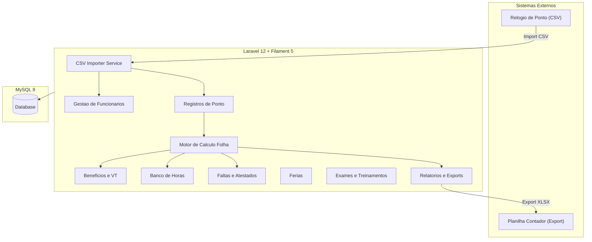
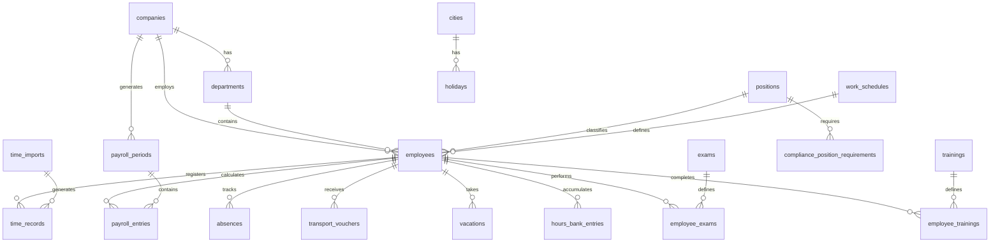

# Sistema de Gestao de Pessoas e Financas - CONSERVICOS

## 1. Visao Geral da Arquitetura

### Stack Tecnologico

- **Backend**: PHP 8.3+ / Laravel 12
- **Admin Panel**: Filament 5 (Livewire + Blade + Tailwind)
- **Banco de dados**: MySQL 8 (recomendado por volume de dados e integridade relacional)
- **Filas**: Laravel Queues com database driver (para imports CSV pesados)
- **Cache**: File/Redis (conforme necessidade)
- **Storage**: Local filesystem (atestados, documentos)
- **Auth**: Filament Shield (permissoes via Spatie Permission)

### Justificativa do Filament 5

O Filament elimina a necessidade de construir CRUDs manualmente, oferecendo:

- Tables com filtros, busca e export nativos
- Forms com validacao integrada
- Upload de arquivos (atestados, contratos)
- Dashboards com widgets e graficos
- Import/Export CSV nativo
- Notificacoes e alertas
- Relacionamentos complexos em formularios
- Tudo server-rendered com Livewire (leve, sem SPA)

### Diagrama de Arquitetura




---

## 2. Modelagem de Dados (Database Schema)

### Diagrama ER Simplificado




### Tabelas Detalhadas

#### `companies` - Empresas

- `id`, `name`, `trade_name`, `cnpj` (unique), `inscricao_estadual`, `address`, `city`, `state`, `phone`, `email`, `active`, `timestamps`
- Duas empresas identificadas: **SERVICON SERVICOS LTDA** (CNPJ 03225148000112) e **LARA P R ROCHA PSICOLOGIA E SERVICOS LTDA** (CNPJ 44053313000183)

#### `departments` - Departamentos

- `id`, `company_id` (FK), `name`, `active`, `timestamps`
- Departamentos identificados: RIOGRANDENSE, CD MDIAS, MOINHO RIBEIRA

#### `positions` - Cargos

- `id`, `name`, `weekly_hours` (carga horaria semanal), `base_salary`, `description`, `active`, `timestamps`
- Cargos identificados: AJUDANTE DE CARGAS, OPERADOR EMPILHADEIRA, ANALISTA DE LOGISTICA, CONFERENTE, AUXILIAR DE ESCRITORIO, AUXILIAR DE PATIO

#### `work_schedules` - Escalas/Horarios de Trabalho

- `id`, `name`, `type` (enum: regular, scale_12x36, scale_6x2, custom), `daily_hours`, `weekly_hours`, `start_time`, `end_time`, `is_night_shift`, `description`, `active`, `timestamps`
- Escalas identificadas nos CSVs:
  - `6H AS 14:20H SEG A SAB (MOINHO)` - regular
  - `13:40H AS 22H SEG A SAB (MOINHO)` - regular
  - `21:45 AS 06:33H (CD M DIAS)` - noturno
  - `NOITE - ESCALA 12X36 - IMPAR (MOINHO)` - 12x36
  - `NOITE - ESCALA 12X36 - PAR (MOINHO)` - 12x36
  - `ESCALA 6X2 13H AS 21:15` - 6x2
  - `08H AS 17H SEG A SEXT E SAB 08H AS 12H (CD M DIAS)` - regular
  - `20H (RIOGRANDENSE)`, `7H (RIOGRANDENSE)`, `8H (RIOGRANDENSE)` - regular

#### `cities` - Cidades (para feriados municipais)

- `id`, `name`, `state`, `ibge_code`, `timestamps`

#### `holidays` - Feriados

- `id`, `name`, `date`, `city_id` (FK nullable - null = nacional), `recurring` (bool - repete anualmente), `active`, `timestamps`
- Feriados identificados nos CSVs: "Ano novo", "Santos Reis"

#### `employees` - Funcionarios

- `id`, `company_id` (FK), `department_id` (FK), `position_id` (FK), `work_schedule_id` (FK)
- **Dados pessoais**: `name`, `social_name`, `cpf` (unique), `pis`, `rg`, `birth_date`, `gender`, `marital_status`, `nationality`, `naturality`, `father_name`, `mother_name`, `blood_type`
- **Contato**: `phone`, `emergency_phone`, `email`, `address`, `neighborhood`, `city`, `state`, `zip_code`
- **Registro**: `matricula`, `folha`, `ctps`, `admission_date`, `termination_date`, `termination_reason`
- **Documentos**: `cnh`, `cnh_category`, `cnh_expiration`
- **Dados bancarios**: `bank_code` (codigo do banco - ex: 001 BB, 104 CEF), `bank_name`, `agency` (agencia sem digito), `agency_digit`, `account_number` (conta sem digito), `account_digit`, `account_type` (enum: checking, savings - corrente/poupanca), `pix_key_type` (enum: cpf, phone, email, random, nullable), `pix_key` (string nullable)
- **Controle**: `hours_bank_start_date`, `external_id` (id do sistema de ponto), `active`, `observations`, `timestamps`

#### `time_imports` - Historico de Importacoes

- `id`, `company_id` (FK), `user_id` (FK), `filename`, `original_filename`, `period_month`, `period_year`, `type` (enum: employees, time_report), `records_count`, `status` (enum: pending, processing, completed, failed), `errors` (JSON), `imported_at`, `timestamps`

#### `time_records` - Registros de Ponto (importados do CSV)

- `id`, `time_import_id` (FK), `employee_id` (FK), `date`
- **Marcacoes**: `entry_1`, `exit_1`, `entry_2`, `exit_2` (time nullable)
- **Totais**: `total_normal_hours` (minutos), `total_night_hours` (minutos)
- **Classificacao**: `day_type` (enum: worked, sunday, holiday, folga, folga_bh, vacation, medical_leave, wedding_leave, absence, other_justified)
- **Contadores**: `is_absence_day` (bool), `is_worked_day` (bool)
- **Horas**: `absence_hours` (minutos), `bonus_hours` (minutos/abono), `overtime_50` (minutos), `overtime_100` (minutos), `negative_bank_hours` (minutos)
- **Justificativa**: `justification`, `holiday_name`
- **Dados originais**: `raw_entry_1`, `raw_exit_1`, `raw_entry_2`, `raw_exit_2` (strings originais do CSV para auditoria)
- `timestamps`
- Index composto: `[employee_id, date]` unique

#### `payroll_periods` - Periodos da Folha

- `id`, `company_id` (FK), `month`, `year`, `status` (enum: draft, calculating, calculated, reviewed, closed), `calculated_at`, `closed_at`, `closed_by`, `notes`, `timestamps`

#### `payroll_entries` - Lancamentos da Folha (1 por funcionario/periodo)

- `id`, `payroll_period_id` (FK), `employee_id` (FK)
- **Dias**: `total_worked_days`, `total_absence_days`, `total_justified_absence_days`, `total_sundays`, `total_holidays`, `total_folgas`
- **Horas normais**: `total_normal_hours`, `total_night_hours`
- **Horas extras**: `overtime_50_hours`, `overtime_50_value`, `overtime_100_hours`, `overtime_100_value`
- **Adicional noturno**: `night_differential_hours`, `night_differential_value`
- **DSR**: `dsr_base_value`, `dsr_discount_value`, `dsr_final_value`
- **VT**: `transport_voucher_days`, `transport_voucher_daily_value`, `transport_voucher_total`
- **Banco de horas**: `hours_bank_balance`, `hours_bank_credit`, `hours_bank_debit`
- **Status especiais**: `vacation_notes`, `inss_notes`, `termination_notes`
- **Totais**: `base_salary`, `gross_additions`, `gross_deductions`, `observations`
- `timestamps`

#### `transport_vouchers` - Controle de Vale Transporte

- `id`, `employee_id` (FK), `month`, `year`, `daily_value`, `total_days`, `total_value`, `notes`, `timestamps`

#### `vacations` - Controle de Ferias

- `id`, `employee_id` (FK), `acquisition_period_start`, `acquisition_period_end`, `scheduled_start`, `scheduled_end`, `actual_start`, `actual_end`, `days_enjoyed`, `days_sold`, `status` (enum: pending, scheduled, in_progress, completed, expired), `notes`, `timestamps`

#### `absences` - Registro de Faltas e Atestados

- `id`, `employee_id` (FK), `date`, `type` (enum: unjustified, medical_certificate, wedding_leave, paternity_leave, bereavement_leave, other_justified)
- `justified` (bool), `justification_text`, `attachment_path` (arquivo do atestado), `cid_code`, `days_count`, `notes`, `timestamps`

#### `hours_bank_entries` - Movimentacoes do Banco de Horas

- `id`, `employee_id` (FK), `date`, `type` (enum: credit, debit), `minutes`, `source` (enum: import, manual, folga_bh, overtime_conversion), `description`, `reference_time_record_id` (FK nullable), `timestamps`

#### `exams` - Tipos de Exames Ocupacionais

- `id`, `name`, `description`, `category` (enum: occupational_health, regulatory_norm), `nr_reference` (string nullable - ex: "NR-11", "NR-35"), `validity_months`, `is_mandatory`, `requires_attachment`, `active`, `timestamps`
- **Dados iniciais (Seeder)**:
  - **Saude Ocupacional**: Exame Admissional (0 meses - unico), Exame Periodico/ASO (12 meses), Exame Demissional (0 meses - unico), Exame de Retorno ao Trabalho (0 meses - unico), Exame de Mudanca de Funcao (0 meses - unico)
  - **Normas Regulamentadoras**: NR-11 Empilhadeira/Transporte de Materiais (12 meses), NR-12 Seguranca em Maquinas (12 meses), NR-35 Trabalho em Altura (24 meses), NR-06 EPIs (12 meses)

#### `employee_exams` - Exames por Funcionario

- `id`, `employee_id` (FK), `exam_id` (FK), `performed_date`, `expiration_date` (nullable para exames unicos), `provider` (clinica/laboratorio), `doctor_name`, `crm`, `status` (enum: valid, expiring_30d, expiring_15d, expired, not_applicable), `result` (enum: fit, unfit, fit_with_restrictions, nullable), `restrictions` (text nullable), `attachment_path` (ASO digitalizado), `notes`, `timestamps`
- **Regra de status automatico**: calculado diariamente via Scheduler - `valid` se expiration_date > hoje+30d, `expiring_30d` se entre 15d e 30d, `expiring_15d` se < 15d, `expired` se vencido

#### `trainings` - Tipos de Treinamentos

- `id`, `name`, `description`, `category` (enum: operational, safety, regulatory, onboarding), `nr_reference` (string nullable), `validity_months`, `required_hours` (carga horaria minima), `is_mandatory`, `requires_certificate`, `active`, `timestamps`
- **Dados iniciais (Seeder)**:
  - **Operacional**: Operacao de Empilhadeira (12 meses, NR-11), Movimentacao Manual de Cargas (12 meses, NR-11)
  - **Seguranca**: Seguranca do Trabalho Geral (12 meses), Brigada de Incendio/CIPA (12 meses, NR-23), Primeiros Socorros (24 meses)
  - **Integracao**: Integracao de Novos Funcionarios (0 meses - unico)

#### `employee_trainings` - Treinamentos por Funcionario

- `id`, `employee_id` (FK), `training_id` (FK), `performed_date`, `expiration_date` (nullable para treinamentos unicos), `instructor_name`, `institution`, `hours_completed`, `status` (enum: valid, expiring_30d, expiring_15d, expired, not_applicable), `grade` (nota/conceito nullable), `attachment_path`, `certificate_path`, `notes`, `timestamps`
- **Regra de status automatico**: mesma logica dos exames

#### `payment_batches` - Lotes de Pagamento

- `id`, `company_id` (FK), `type` (enum: salary, advance, vacation, termination, transport_voucher, meal_voucher), `reference_month`, `reference_year`, `payment_date`, `bank_code` (banco pagador da empresa), `total_amount` (decimal 12,2), `total_records`, `status` (enum: draft, generated, sent_to_bank, processed, rejected), `cnab_format` (enum: cnab_240, cnab_400), `file_path` (arquivo CNAB gerado), `return_file_path` (arquivo retorno do banco nullable), `notes`, `generated_by` (FK user), `generated_at`, `timestamps`

#### `payment_batch_items` - Itens do Lote de Pagamento

- `id`, `payment_batch_id` (FK), `employee_id` (FK), `amount` (decimal 10,2), `payment_method` (enum: bank_transfer, pix), `bank_code`, `agency`, `agency_digit`, `account_number`, `account_digit`, `account_type`, `pix_key`, `status` (enum: pending, paid, rejected, returned), `rejection_reason` (string nullable), `reference_id` (FK nullable - payroll_entry_id, transport_voucher_id, vacation_id conforme tipo), `notes`, `timestamps`

#### `company_bank_accounts` - Contas Bancarias da Empresa (pagadora)

- `id`, `company_id` (FK), `bank_code`, `bank_name`, `agency`, `agency_digit`, `account_number`, `account_digit`, `account_type`, `covenant_code` (codigo do convenio com o banco), `is_default`, `active`, `timestamps`
- Suporta multiplas contas por empresa (BB e Caixa)

#### `compliance_position_requirements` - Exigencias por Cargo (tabela pivot)

- `id`, `position_id` (FK), `requireable_type` (morph: exam ou training), `requireable_id`, `is_mandatory`, `timestamps`
- Permite definir quais exames e treinamentos sao obrigatorios para cada cargo (ex: OPERADOR EMPILHADEIRA exige NR-11, NR-12; AJUDANTE DE CARGAS exige NR-11, NR-35)

---

## 3. Regras de Negocio Criticas

### 3.1 Calculo de DSR (Descanso Semanal Remunerado)

- DSR e calculado com base nas folgas da semana
- Faltas injustificadas na semana afetam o DSR proporcional
- Formula: `DSR = (Salario / dias_uteis_mes) * domingos_e_feriados`
- Desconto DSR por falta: `Desconto = (valor_DSR / dias_uteis_semana) * faltas_semana`

### 3.2 Horas Extras

- **50%**: Horas excedentes em dias normais que nao viram banco de horas; pagas apos 30 dias caso nao haja gozo de folga
- **100%**: Trabalho em domingos ou feriados, pagamento integral
- Campos ja vem calculados no CSV do ponto (`Extra 50%`, `Extra 100%`)

### 3.3 Adicional Noturno

- Ja vem calculado no CSV do ponto (`Total Noturno`)
- Transferido direto para a planilha da folha
- Periodo noturno: 22h as 05h (hora noturna = 52min30s)

### 3.4 Banco de Horas

- Horas extras que nao sao pagas viram credito no banco
- Folga BH: debito no banco quando o funcionario folga
- Banco negativo ja vem no CSV
- Controle de saldo com historico de movimentacoes
- Apos 30 dias sem gozo de folga, horas extras sao pagas

### 3.5 Escalas 12x36

- Dias livres lancados como "Folga" no ponto, mas nao sao folgas reais (sao dias de descanso da escala)
- Importante diferenciar "Folga" de escala vs "Folga BH" vs "Folga" real

### 3.6 Vale Transporte

- Calculado com base nos dias efetivamente trabalhados (campo `Dias Trabalhados` do CSV)
- Lancamento mensal para registro

### 3.7 Tipos de Justificativa (identificados nos CSVs)

- Ferias, Folga BH, Atestado Medico, Licenca Casamento, Abono, Feriado, Domingo, Falta

### 3.8 Compliance - Exames e Treinamentos Obrigatorios

A empresa e de terceirizacao de servicos pesados (carregamento, lonamento de caminhoes, operacao de empilhadeiras, movimentacao de estoques). As NRs fiscalizadas incluem:

- **NR-06** (EPIs): controle de entrega e treinamento de uso - validade 12 meses
- **NR-11** (Empilhadeira/Transporte de Materiais): obrigatorio para operadores de empilhadeira e ajudantes de carga - validade 12 meses
- **NR-12** (Seguranca em Maquinas): obrigatorio para operadores - validade 12 meses
- **NR-35** (Trabalho em Altura): para atividades de lonamento e carregamento - validade 24 meses
- **ASO (Exame Periodico)**: obrigatorio para todos os funcionarios - validade 12 meses
- Exames admissional, demissional, retorno e mudanca de funcao sao pontuais (sem recorrencia)

**Regras de status**:

- `valid`: vencimento > 30 dias a partir de hoje
- `expiring_30d`: vencimento entre 16 e 30 dias
- `expiring_15d`: vencimento entre 1 e 15 dias
- `expired`: vencimento ultrapassado
- Recalculo diario via Artisan Scheduler (Command `app:update-compliance-status`)

**Exigencias por cargo** (exemplos):

- OPERADOR EMPILHADEIRA: ASO, NR-11, NR-12, Operacao de Empilhadeira
- AJUDANTE DE CARGAS: ASO, NR-11, NR-35, NR-06, Movimentacao Manual de Cargas, Seguranca do Trabalho
- ANALISTA DE LOGISTICA: ASO, NR-06, Integracao
- CONFERENTE: ASO, NR-06, NR-11, Seguranca do Trabalho

---

## 4. Funcionalidades Detalhadas por Modulo

### Modulo 1: Administracao

- CRUD de Empresas (SERVICON e LARA)
- CRUD de Departamentos (RIOGRANDENSE, CD MDIAS, MOINHO RIBEIRA)
- CRUD de Cargos com carga horaria semanal
- CRUD de Escalas/Horarios de trabalho
- CRUD de Cidades e Feriados por cidade
- Gestao de usuarios e permissoes (admin, gestor, contador)

### Modulo 2: Gestao de Funcionarios

- Cadastro completo com todos os campos do CSV `person_*.csv`
- Import CSV de funcionarios (formato do sistema de ponto)
- Ficha do funcionario com historico
- Filtros por empresa, departamento, cargo, status (ativo/demitido)
- Data de admissao, demissao, observacoes
- Upload de documentos

### Modulo 3: Importacao de Ponto

- Import CSV de relatorios de ponto (`relatorio_*.csv`)
- Parser inteligente que identifica os dois formatos de CSV (com e sem Extra 50%/100%)
- Deteccao automatica do separador (`;`)
- Validacao: CPF do funcionario deve existir no sistema
- Tratamento dos campos especiais: "Feriado: X", "Justificado X", "Folga", "Domingo", "Falta", timestamps com "(I)"
- Historico de importacoes com status e erros
- Processamento em fila para CSVs grandes (+1600 linhas)
- Preview antes de confirmar importacao

### Modulo 4: Folha de Pagamento

- Calculo automatico a partir dos registros de ponto importados
- DSR com base nas folgas e faltas
- Totalizacao de horas extras 50% e 100%
- Adicional noturno totalizado
- Controle de banco de horas (creditos e debitos)
- Controle de faltas por dia especifico
- Campo de observacoes para ferias, INSS, demitido
- Geracao de planilha para o contador (export XLSX)

### Modulo 5: Beneficios

- Vale Transporte: lancamento mensal, calculo por dias trabalhados
- Controle de valor diario e total recebido
- Historico de lancamentos

### Modulo 6: Ferias

- Controle de periodo aquisitivo e concessivo
- Agendamento e registro de gozo
- Status: pendente, agendada, em gozo, concluida, vencida
- Alerta de ferias vencendo

### Modulo 7: Faltas e Atestados

- Registro de faltas com justificativa
- Upload de atestado medico (arquivo)
- Tipos: injustificada, atestado, licenca casamento, licenca paternidade, luto, outros
- Historico por funcionario

### Modulo 8: Compliance - Exames e Treinamentos

A empresa opera com carregamento/lonamento de caminhoes, operacao de empilhadeiras e movimentacao de estoques pesados. Exames ocupacionais e treinamentos de NRs sao obrigatorios e fiscalizados.

- **Cadastro de Tipos de Exame** com categoria (saude ocupacional vs norma regulamentadora), referencia a NR, validade em meses, obrigatoriedade e exigencia de anexo
- **Cadastro de Tipos de Treinamento** com categoria (operacional, seguranca, regulatorio, integracao), referencia a NR, validade, carga horaria minima, obrigatoriedade de certificado
- **Exigencias por Cargo**: matriz que define quais exames e treinamentos sao obrigatorios para cada cargo (ex: Operador Empilhadeira requer NR-11 e NR-12)
- **Registro de Exames por Funcionario**: data de realizacao, vencimento automatico, clinica, medico, CRM, resultado (apto/inapto/apto com restricoes), upload do ASO
- **Registro de Treinamentos por Funcionario**: data, vencimento automatico, instrutor, instituicao, carga horaria cumprida, upload de certificado
- **Status automatico**: job diario (Scheduler) que recalcula status de todos os registros: valido -> vencendo em 30d -> vencendo em 15d -> vencido
- **Dashboard de Compliance**: widget dedicado no painel principal mostrando:
  - Contadores: total vencidos (vermelho), vencendo em 15 dias (laranja), vencendo em 30 dias (amarelo)
  - Tabela com lista de funcionarios com pendencias, ordenada por urgencia
  - Filtro por tipo de exame/treinamento, departamento e cargo
- **Ficha do Funcionario**: aba "Compliance" mostrando todos os exames e treinamentos com status visual (badges coloridos), datas e proximos vencimentos
- **Relatorio de Compliance**: export XLSX/PDF com situacao de todos os funcionarios vs exigencias do cargo, destacando pendencias

### Modulo 9: Pagamentos Bancarios

A empresa utiliza Banco do Brasil (001) e Caixa Economica Federal (104) para pagamentos. O sistema deve gerar arquivos CNAB 240 e CNAB 400 conforme o banco.

- **Dados bancarios do funcionario**: conta corrente/poupanca com banco, agencia, conta e digitos; chave PIX (CPF, telefone, email ou aleatoria)
- **Contas bancarias da empresa**: cadastro das contas pagadoras (BB e Caixa), codigo de convenio, conta padrao
- **Criacao de lotes de pagamento** por tipo:
  - Salario/Folha de pagamento (a partir do payroll_entries calculado)
  - Adiantamento salarial
  - Ferias
  - Verbas rescisorias
  - Vale Transporte
  - Vale Alimentacao/Refeicao
- **Geracao de arquivo CNAB**: servico que gera o arquivo no formato CNAB 240 ou CNAB 400, com headers, detalhes e trailers conforme layout do BB e da Caixa
- **Suporte a PIX**: itens do lote podem ser pagos via transferencia bancaria tradicional ou PIX (usando chave do funcionario)
- **Fluxo**: Criar lote (draft) -> Revisar itens -> Gerar arquivo CNAB (generated) -> Download para envio ao banco -> Marcar como enviado (sent_to_bank) -> Importar arquivo retorno do banco -> Atualizar status dos itens (paid/rejected)
- **Historico de lotes** com status visual e download dos arquivos gerados

### Modulo 10: Relatorios

- Folha de pagamento mensal (formato contador)
- Resumo de horas extras por funcionario
- Controle de banco de horas
- Relatorio de faltas e atestados
- Relatorio de VT
- Relatorio de exames/treinamentos vencendo
- Relatorio de pagamentos bancarios por lote/periodo
- Export em XLSX e PDF

### Modulo 11: Dashboard

- Total de funcionarios ativos por empresa/departamento
- Horas extras do mes
- Faltas do mes
- Exames/treinamentos vencendo
- Ferias programadas
- Saldo de banco de horas
- Lotes de pagamento pendentes/enviados

---

## 5. Plano de Desenvolvimento (Sprints)

### Sprint 1 - Setup e Fundacao (Semana 1-2)

- Criar projeto Laravel 12
- Instalar e configurar Filament 5
- Configurar Spatie Permission + Filament Shield
- Criar migrations para: `companies`, `departments`, `positions`, `work_schedules`, `cities`, `holidays`, `users`
- Criar Resources Filament para todos os CRUDs acima
- Seeders com dados das duas empresas e departamentos

### Sprint 2 - Gestao de Funcionarios (Semana 3-4)

- Migration `employees` com todos os campos
- Filament Resource para Employee (form completo, tabela com filtros)
- CSV Importer para `person_*.csv` (usando Filament ImportAction)
- Relacionamentos: empresa, departamento, cargo, escala

### Sprint 3 - Importacao de Ponto (Semana 5-6)

- Migrations: `time_imports`, `time_records`
- Service `TimeReportImporter` para parsear os CSVs do ponto
- Tratamento dos dois formatos identificados (com/sem Extra 50%/100%)
- Job em fila para processamento pesado
- Filament Resource para Time Imports (upload, historico, status)
- Filament Resource para Time Records (visualizacao, filtros por funcionario/periodo)

### Sprint 4 - Faltas, Atestados e Banco de Horas (Semana 7-8)

- Migrations: `absences`, `hours_bank_entries`
- Filament Resource para Absences (com upload de atestado)
- Filament Resource para Hours Bank
- Logica de populacao automatica a partir do import de ponto
- Calculo de saldo de banco de horas

### Sprint 5 - Folha de Pagamento (Semana 9-11)

- Migrations: `payroll_periods`, `payroll_entries`
- Service `PayrollCalculator` com todas as regras:
  - DSR, horas extras, adicional noturno, faltas, banco de horas
- Filament Resource para Payroll Period (criar periodo, calcular, revisar, fechar)
- Filament Resource para Payroll Entry (visualizar detalhe por funcionario)
- Export XLSX para contador

### Sprint 6 - Beneficios, Ferias, Exames (Semana 12-14)

- Migrations: `transport_vouchers`, `vacations`, `exams`, `employee_exams`, `trainings`, `employee_trainings`
- Filament Resources para cada entidade
- Logica de calculo de VT por dias trabalhados
- Alertas de vencimento de exames/treinamentos
- Controle de periodo aquisitivo de ferias

### Sprint 7 - Pagamentos Bancarios (Semana 15-17)

- Migrations: `company_bank_accounts`, `payment_batches`, `payment_batch_items`
- Filament Resource para Company Bank Accounts (contas BB e Caixa)
- Service `CnabGeneratorService` com suporte a CNAB 240 e CNAB 400 para BB (001) e CEF (104)
- Filament PaymentBatchResource: criar lote por tipo, selecionar funcionarios, gerar arquivo, download, importar retorno
- Fluxo completo: draft -> generated -> sent_to_bank -> processed
- Suporte a PIX como metodo de pagamento alternativo

### Sprint 8 - Dashboard e Relatorios (Semana 18-19)

- Dashboard Filament com widgets:
  - StatsOverview (funcionarios, horas extras, faltas)
  - Charts (tendencias mensais)
  - Tables (vencimentos proximos, lotes pendentes)
  - ComplianceOverview (exames/treinamentos vencendo)
- Relatorios em XLSX/PDF (incluindo relatorio de pagamentos bancarios)
- Refinamentos de UX e validacoes finais

---

## 6. Estrutura de Diretorios Laravel

```
app/
  Console/
    Commands/
      UpdateComplianceStatusCommand.php   -> Recalcula status de exames/treinamentos
  Enums/
    DayType.php, PayrollStatus.php, AbsenceType.php, VacationStatus.php,
    ExamCategory.php, ExamResult.php, ComplianceStatus.php,
    TrainingCategory.php, WorkScheduleType.php,
    PaymentBatchType.php, PaymentBatchStatus.php, PaymentMethod.php,
    CnabFormat.php, PaymentItemStatus.php, PixKeyType.php, AccountType.php
  Filament/
    Resources/
      CompanyResource.php, DepartmentResource.php, PositionResource.php,
      WorkScheduleResource.php, CityResource.php, HolidayResource.php,
      EmployeeResource.php (com aba Compliance),
      TimeImportResource.php, TimeRecordResource.php,
      PayrollPeriodResource.php, PayrollEntryResource.php,
      AbsenceResource.php, HoursBankEntryResource.php,
      TransportVoucherResource.php, VacationResource.php,
      ExamResource.php, EmployeeExamResource.php,
      TrainingResource.php, EmployeeTrainingResource.php,
      CompanyBankAccountResource.php, PaymentBatchResource.php
    Widgets/
      StatsOverviewWidget.php
      MonthlyOvertimeChart.php
      AbsencesChart.php
      ComplianceOverviewStats.php        -> Cards vencidos/vencendo
      ComplianceAlertTable.php           -> Tabela de pendencias urgentes
      UpcomingVacationsTable.php
      PendingPaymentsWidget.php          -> Lotes de pagamento pendentes
    Pages/
      Dashboard.php
    Imports/
      EmployeeCsvImporter.php
      TimeReportCsvImporter.php
    Exports/
      PayrollExporter.php
      ComplianceReportExporter.php
  Models/
    Company.php, Department.php, Position.php, WorkSchedule.php,
    City.php, Holiday.php, Employee.php, TimeImport.php, TimeRecord.php,
    PayrollPeriod.php, PayrollEntry.php, Absence.php, HoursBankEntry.php,
    TransportVoucher.php, Vacation.php,
    Exam.php, EmployeeExam.php, Training.php, EmployeeTraining.php,
    CompliancePositionRequirement.php,
    CompanyBankAccount.php, PaymentBatch.php, PaymentBatchItem.php
  Services/
    TimeReportImporterService.php
    PayrollCalculatorService.php
    DsrCalculatorService.php
    HoursBankService.php
    TransportVoucherService.php
    ComplianceService.php               -> Logica de status e verificacao de pendencias
    CnabGeneratorService.php           -> Gera arquivos CNAB 240/400 para BB e Caixa
    CnabReturnReaderService.php        -> Le arquivos retorno do banco
  Jobs/
    ProcessTimeReportImport.php
  Observers/
    TimeRecordObserver.php
    AbsenceObserver.php
database/
  migrations/
  seeders/
    CompanySeeder.php
    DepartmentSeeder.php
    PositionSeeder.php
    WorkScheduleSeeder.php
    HolidaySeeder.php
    ExamSeeder.php                      -> Tipos de exame com NRs
    TrainingSeeder.php                  -> Tipos de treinamento com NRs
    ComplianceRequirementSeeder.php     -> Exigencias por cargo
```

---

## 7. Prompts para Agente de Desenvolvimento

### Prompt Principal (Contexto do Projeto)

```
Voce e um desenvolvedor Laravel senior especializado em sistemas de gestao de RH e folha de pagamento brasileira.

Estamos construindo o sistema CONSERVICOS - um sistema de gestao de pessoas e financas para duas empresas de logistica (SERVICON SERVICOS LTDA e LARA P R ROCHA PSICOLOGIA E SERVICOS LTDA).

Stack: Laravel 12 + Filament 5 + MySQL 8 + Tailwind CSS

A empresa e de terceirizacao de servicos pesados (carregamento, lonamento de caminhoes, operacao de empilhadeiras, movimentacao de estoques). O sistema importa dados de um relogio de ponto via CSV (separador ;) e processa folha de pagamento com calculos de DSR, horas extras 50% e 100%, adicional noturno, banco de horas, controle de faltas/atestados, vale transporte, ferias, exames ocupacionais (NRs) e treinamentos obrigatorios. Tambem gera arquivos CNAB 240/400 para pagamento de salarios e beneficios via Banco do Brasil e Caixa Economica Federal.

Regras importantes:
- Todo o codigo deve estar em ingles (nomes de classes, metodos, variaveis)
- Labels e textos de interface devem estar em portugues BR
- Usar Filament Resources para todos os CRUDs
- Usar Enums do PHP 8.3 para tipos e status
- Usar Services para logica de negocio (nunca em controllers/resources)
- Usar Jobs para processamento pesado (imports)
- Manter migrations com campos NOT NULL quando possivel, com defaults apropriados
- Indices nos campos mais consultados (employee_id, date, cpf)
- Soft deletes nos models principais (Employee, Company)
```

### Prompts por Sprint

**Sprint 1 - Setup:**

```
Crie o projeto Laravel 12 com Filament 5. Configure:
1. Filament Panel com tema customizado (cores da marca)
2. Spatie Permission com Filament Shield
3. Migrations e Models para: companies, departments, positions, work_schedules, cities, holidays
4. Filament Resources com forms e tables para cada model
5. Seeders com os dados reais das empresas: SERVICON (CNPJ 03225148000112) e LARA (CNPJ 44053313000183), departamentos (RIOGRANDENSE, CD MDIAS, MOINHO RIBEIRA), e cargos identificados
6. Enums: WorkScheduleType (regular, scale_12x36, scale_6x2, custom)
7. Cadastro de feriados com suporte a feriados nacionais e municipais (por cidade)
```

**Sprint 2 - Funcionarios:**

```
Implemente o modulo de gestao de funcionarios:
1. Migration employees com todos os campos: dados pessoais (name, social_name, cpf, pis, rg, birth_date, gender, marital_status), contato (phone, emergency_phone, email, endereco completo), registro (matricula, folha, ctps, admission_date, termination_date, termination_reason), documentos (cnh, cnh_category, cnh_expiration), dados bancarios (bank_code, bank_name, agency, agency_digit, account_number, account_digit, account_type enum checking/savings, pix_key_type enum cpf/phone/email/random nullable, pix_key nullable), controle (hours_bank_start_date, external_id, active, observations)
2. Model Employee com relacionamentos (company, department, position, work_schedule) e scopes (active, terminated, byCompany, byDepartment)
3. Filament EmployeeResource com: form em tabs (Dados Pessoais, Contato, Registro, Documentos, Dados Bancarios), tabela com colunas essenciais e filtros por empresa/departamento/cargo/status
4. Tab "Dados Bancarios" no form: bank_code (Select com opcoes 001-BB, 104-CEF e outros), bank_name (preenchido automaticamente), agency, agency_digit, account_number, account_digit, account_type (corrente/poupanca), pix_key_type (CPF, Telefone, Email, Aleatoria), pix_key (validacao condicional conforme tipo)
5. CSV Importer que leia o formato do arquivo person_*.csv (separador ;) mapeando os campos: id_funcionario->external_id, CPF->cpf, PIS->pis, Nome->name, Matricula->matricula, Empresa->company (lookup por nome), Departamento->department (lookup), Cargo->position (lookup), Data de Admissao->admission_date, Data de Nascimento->birth_date, Data de Demissao->termination_date, Horario de Trabalho->work_schedule (lookup)
```

**Sprint 3 - Importacao de Ponto:**

```
Implemente o sistema de importacao de relatorios de ponto via CSV:
1. Migrations: time_imports (company_id, user_id, filename, period_month, period_year, type enum, records_count, status enum, errors json) e time_records (time_import_id, employee_id, date, entry_1, exit_1, entry_2, exit_2 como time nullable, total_normal_hours e total_night_hours em minutos, day_type enum, is_absence_day, is_worked_day, absence_hours, bonus_hours, overtime_50, overtime_100, negative_bank_hours em minutos, justification, holiday_name, raw_entry_1-4 strings)
2. Service TimeReportImporterService que:
   - Detecta o formato do CSV (com ou sem colunas Extra 50%/Extra 100%)
   - Parseia o campo Dia no formato "DD/MM/YYYY DDD"
   - Identifica day_type a partir dos campos Entrada/Saida: "Feriado: X" -> holiday, "Domingo" -> sunday, "Folga" -> day_off, "Justificado Ferias" -> vacation, "Justificado Atestado Medico" -> medical_leave, "Justificado Licenca Casamento" -> wedding_leave, "Justificado Folga BH" -> bank_hours_off, "Falta" -> absence, timestamps -> worked
   - Converte horas (HH:MM) para minutos inteiros
   - Trata timestamps com sufixo "(I)" removendo o sufixo
   - Vincula ao employee via CPF
   - Salva raw_entry_* com os valores originais do CSV
3. Job ProcessTimeReportImport para processamento em fila
4. Filament TimeImportResource com: upload de CSV, preview dos dados, botao de processar, historico com status
5. Filament TimeRecordResource somente leitura com: tabela mostrando registros diarios, filtros por funcionario/periodo/tipo de dia, cores por day_type
```

**Sprint 4 - Faltas e Banco de Horas:**

```
Implemente os modulos de faltas/atestados e banco de horas:
1. Migration absences: employee_id, date, type enum (unjustified, medical_certificate, wedding_leave, paternity_leave, bereavement_leave, other_justified), justified bool, justification_text, attachment_path, cid_code, days_count, notes
2. Migration hours_bank_entries: employee_id, date, type enum (credit, debit), minutes int, source enum (import, manual, bank_hours_off, overtime_conversion), description, reference_time_record_id nullable
3. Service HoursBankService com metodos: addCredit, addDebit, getBalance, processTimeRecords (cria entradas automaticamente a partir dos time_records importados - overtime vira credito, folga_bh vira debito, banco negativo vira debito)
4. Observer TimeRecordObserver que ao criar time_records, automaticamente cria absences (quando day_type = absence) e hours_bank_entries (quando ha overtime ou folga_bh ou banco negativo)
5. Filament AbsenceResource com upload de atestado e filtros
6. Filament HoursBankResource com saldo atual e historico de movimentacoes, filtrado por funcionario
```

**Sprint 5 - Folha de Pagamento:**

```
Implemente o motor de calculo da folha de pagamento:
1. Migrations: payroll_periods (company_id, month, year, status enum, calculated_at, closed_at, notes) e payroll_entries (payroll_period_id, employee_id, todos os campos de totalizacao: worked_days, absence_days, justified_absence_days, normal_hours, night_hours, overtime_50_hours/value, overtime_100_hours/value, night_differential_hours/value, dsr_base/discount/final, transport_voucher_days/daily_value/total, hours_bank_balance/credit/debit, base_salary, gross_additions, gross_deductions, vacation_notes, inss_notes, termination_notes, observations)
2. Service PayrollCalculatorService:
   - Metodo calculate(PayrollPeriod): itera funcionarios ativos da empresa, busca time_records do periodo, e calcula cada payroll_entry
   - Calculo DSR: (salario_base / dias_uteis) * (domingos + feriados) - desconto proporcional por faltas injustificadas na semana
   - Horas extras: soma overtime_50 e overtime_100 dos time_records, aplica percentuais sobre valor hora
   - Adicional noturno: soma total_night_hours, aplica 20% sobre valor hora
   - VT: conta dias trabalhados, multiplica por valor diario do funcionario
   - Banco de horas: saldo atual do HoursBankService
3. Service DsrCalculatorService separado com a logica detalhada do DSR
4. Filament PayrollPeriodResource: criar periodo, botao "Calcular Folha", status visual, botao "Fechar Periodo"
5. Filament PayrollEntryResource: tabela com todos os totais por funcionario, filtros, export XLSX para contador
6. Export XLSX no formato esperado pelo contador com todas as colunas da folha
```

**Sprint 6 - Beneficios e Compliance:**

```
Implemente VT, ferias, e o modulo completo de Compliance (exames e treinamentos):

PARTE A - VT e Ferias:
1. Migrations para transport_vouchers e vacations
2. TransportVoucherService: calcula VT mensal baseado nos dias trabalhados do time_records, permite lancamento manual
3. Filament VacationResource: controle de periodo aquisitivo (12 meses), agendamento, registro de gozo, dias vendidos, alertas de vencimento (limite 12 meses apos aquisitivo)

PARTE B - Compliance (Exames Ocupacionais):
4. Migration exams: name, description, category enum (occupational_health, regulatory_norm), nr_reference string nullable, validity_months, is_mandatory, requires_attachment, active
5. Migration employee_exams: employee_id, exam_id, performed_date, expiration_date nullable, provider, doctor_name, crm, status enum (valid, expiring_30d, expiring_15d, expired, not_applicable), result enum (fit, unfit, fit_with_restrictions) nullable, restrictions text, attachment_path, notes
6. Filament ExamResource: CRUD com campos de NR, validade, obrigatoriedade
7. Filament EmployeeExamResource: form com data, clinica, medico, CRM, resultado (apto/inapto/apto com restricoes), campo restricoes, upload ASO. Tabela com status visual (badges verde/amarelo/laranja/vermelho)
8. Seeder ExamSeeder com: Admissional, Periodico ASO (12m), Demissional, Retorno ao Trabalho, Mudanca de Funcao, NR-11 (12m), NR-12 (12m), NR-35 (24m), NR-06 (12m)

PARTE C - Compliance (Treinamentos):
9. Migration trainings: name, description, category enum (operational, safety, regulatory, onboarding), nr_reference nullable, validity_months, required_hours, is_mandatory, requires_certificate, active
10. Migration employee_trainings: employee_id, training_id, performed_date, expiration_date nullable, instructor_name, institution, hours_completed, status enum (valid, expiring_30d, expiring_15d, expired, not_applicable), grade nullable, attachment_path, certificate_path, notes
11. Filament TrainingResource e EmployeeTrainingResource com upload de certificado e status visual
12. Seeder TrainingSeeder com: Operacao Empilhadeira (12m, NR-11), Movimentacao Manual de Cargas (12m), Seguranca do Trabalho (12m), Brigada de Incendio/CIPA (12m, NR-23), Primeiros Socorros (24m), Integracao (unico)

PARTE D - Exigencias por Cargo e Automacao:
13. Migration compliance_position_requirements: position_id, requireable_type (morph), requireable_id, is_mandatory - define quais exames/treinamentos cada cargo exige
14. Filament: na edicao do Cargo (PositionResource), adicionar Repeater/RelationManager para configurar exames e treinamentos obrigatorios
15. Artisan Command app:update-compliance-status que recalcula o status de todos employee_exams e employee_trainings (valid/expiring_30d/expiring_15d/expired). Registrar no Scheduler para rodar diariamente.
16. Na ficha do funcionario (EmployeeResource), adicionar aba "Compliance" com RelationManagers para exames e treinamentos, mostrando status visual e proximos vencimentos

PARTE E - Dashboard de Compliance:
17. Widget ComplianceOverviewStats: 3 cards - Vencidos (vermelho), Vencendo em 15d (laranja), Vencendo em 30d (amarelo)
18. Widget ComplianceAlertTable: tabela com funcionarios pendentes, colunas: nome, cargo, item pendente, tipo (exame/treinamento), data vencimento, status. Ordenado por urgencia. Filtros por departamento e tipo
```

**Sprint 7 - Pagamentos Bancarios:**

```
Implemente o modulo completo de pagamentos bancarios com geracao de arquivos CNAB:

PARTE A - Contas Bancarias da Empresa:
1. Migration company_bank_accounts: company_id, bank_code, bank_name, agency, agency_digit, account_number, account_digit, account_type, covenant_code (codigo do convenio), is_default, active
2. Filament CompanyBankAccountResource: CRUD vinculado a empresa, com validacao de campos bancarios
3. Seeder com contas do BB (001) e Caixa (104) para as duas empresas

PARTE B - Lotes de Pagamento:
4. Migration payment_batches: company_id, type enum (salary, advance, vacation, termination, transport_voucher, meal_voucher), reference_month, reference_year, payment_date, bank_code, total_amount decimal(12,2), total_records, status enum (draft, generated, sent_to_bank, processed, rejected), cnab_format enum (cnab_240, cnab_400), file_path, return_file_path nullable, notes, generated_by, generated_at
5. Migration payment_batch_items: payment_batch_id, employee_id, amount decimal(10,2), payment_method enum (bank_transfer, pix), bank_code, agency, agency_digit, account_number, account_digit, account_type, pix_key nullable, status enum (pending, paid, rejected, returned), rejection_reason nullable, reference_id nullable, notes
6. Filament PaymentBatchResource com:
   - Criar lote: selecionar tipo (salario, adiantamento, ferias, rescisao, VT, VA/VR), empresa, mes/ano referencia, data pagamento, banco/conta pagadora, formato CNAB
   - Para tipo "salary": popular automaticamente com funcionarios do payroll_entries do periodo (so funciona se folha calculada)
   - Para tipo "transport_voucher": popular com dados do transport_vouchers do periodo
   - Revisao: tabela editavel com todos os itens, valores, dados bancarios do funcionario
   - Botao "Gerar Arquivo CNAB": chama o service e gera o arquivo
   - Download do arquivo gerado
   - Botao "Marcar como Enviado"
   - Upload de arquivo retorno do banco
7. Filament PaymentBatchItemResource: visualizacao em RelationManager dentro do Batch

PARTE C - Gerador CNAB:
8. Service CnabGeneratorService com:
   - Metodo generate(PaymentBatch): gera arquivo conforme formato e banco
   - Suporte a CNAB 240: Header de arquivo, Header de lote, Segmento A (pagamento), Segmento B (dados complementares - endereco), Trailer de lote, Trailer de arquivo
   - Suporte a CNAB 400: Header, Detalhe, Trailer
   - Layouts especificos para BB (001) e CEF (104)
   - Suporte a PIX no Segmento A (forma de pagamento 45 - PIX transferencia)
   - Todos os valores formatados conforme especificacao (sem pontos/virgulas, com zeros a esquerda)
   - Retorna path do arquivo gerado
9. Service CnabReturnReaderService: le arquivo retorno (.RET) do banco e atualiza status dos payment_batch_items (paid/rejected com motivo)

PARTE D - Enums e Validacoes:
10. Enums: PaymentBatchType, PaymentBatchStatus, PaymentMethod, CnabFormat, PaymentItemStatus, PixKeyType, AccountType
11. Validacao: ao criar lote tipo "salary", verificar se o payroll_period esta com status "calculated" ou "closed"
12. Validacao: ao gerar CNAB, verificar se todos os funcionarios tem dados bancarios preenchidos; listar pendencias
```

**Sprint 8 - Dashboard e Relatorios:**

```
Implemente o dashboard principal e sistema de relatorios:
1. Dashboard Filament com widgets:
   - StatsOverviewWidget: total funcionarios ativos, horas extras do mes, faltas do mes, exames vencendo
   - MonthlyOvertimeChart: grafico de barras com horas extras 50% e 100% dos ultimos 6 meses
   - AbsencesChart: grafico de faltas por tipo dos ultimos 6 meses
   - UpcomingVacationsTable: ferias programadas para os proximos 30 dias
   - ExpiringComplianceTable: exames e treinamentos vencendo
   - PendingPaymentsWidget: lotes de pagamento em status draft ou generated (aguardando envio)
2. Pagina de Relatorios com exports:
   - Folha de pagamento mensal (XLSX formato contador)
   - Resumo de horas extras por funcionario (XLSX)
   - Relatorio de banco de horas com saldos (XLSX)
   - Relatorio de faltas e atestados (XLSX/PDF)
   - Relatorio de VT mensal (XLSX)
   - Relatorio de exames/treinamentos vencendo (XLSX/PDF)
   - Relatorio de pagamentos bancarios por lote/periodo (XLSX)
3. Todos os exports usando Filament Export ou maatwebsite/excel
```

---

## 8. Comandos Iniciais de Setup

```bash
# Criar projeto Laravel 12
composer create-project laravel/laravel conservicos
cd conservicos

# Instalar dependencias
composer require filament/filament:"^5.0"
composer require spatie/laravel-permission
composer require bezhansalleh/filament-shield
composer require maatwebsite/excel
composer require barryvdh/laravel-dompdf

# Setup Filament
php artisan filament:install --panels

# Setup Shield
php artisan shield:install

# Configurar .env com MySQL
# Rodar migrations e seeders
php artisan migrate --seed
```

